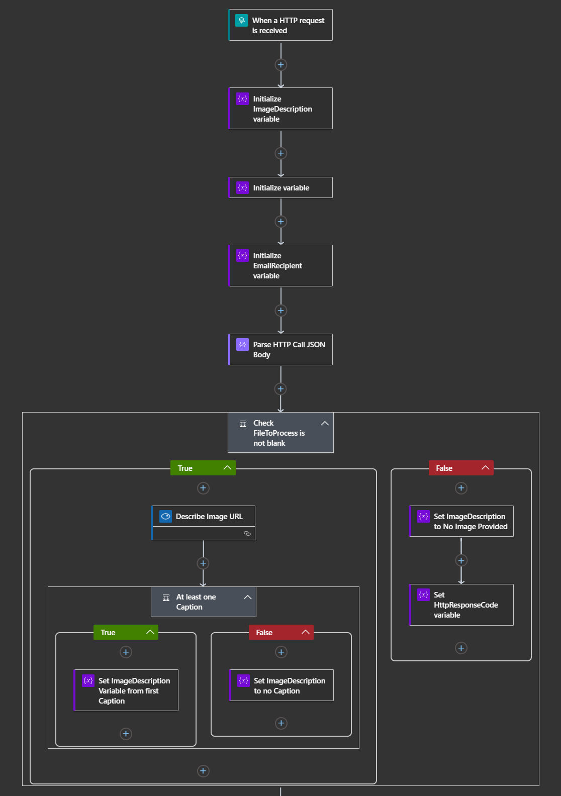

# Azure Logic Apps (Standard) - Demo

This repository contains a sample Azure Logic App (single-tenant), along with a GitHub Action definition for deploying it to an existing Azure Logic App host in Azure.

If you want to work with this sample you will need a copy of Visual Studio Code, along with the Azure Logic Apps preview tooling installed.

Additionally, the sample makes using of [Azure Cognitive Services Computer Vision](https://docs.microsoft.com/azure/cognitive-services/computer-vision/) for [describing supplied images](https://docs.microsoft.com/azure/cognitive-services/computer-vision/concept-describing-images), and uses the [Office 365 Outlook connector](https://docs.microsoft.com/azure/connectors/connectors-create-api-office365-outlook) to send an email. In order to use either of these services you will need a valid Azure and Office 365 subscription.

At time of writing the solution will be editable on Windows and Mac using the Designer view, though on Mac (and Linux) you don't yet have a supported Azure Storage emulator (but it's coming).

Once you have this sample deployed you can send a simple HTTP POST request to the endpoint and supply a public image URL in the body as JSON. Supported image formats are JPEG, PNG, GIF and BMP.

```json
{
    "FileToProcess" : "https://full.url/to/your/image.jpg"
}
```

